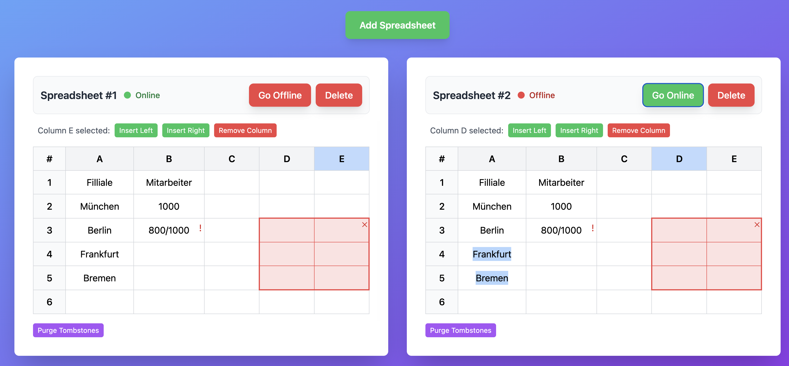

# DAIMPL 2025 tabular-rdt
A Replicated Data Type (RDT) for spreadsheets, enabling Google Docs-like collaborative editing with offline synchronization capabilities.
This is a project for the [DAIMPL 2025 course](https://www.stg.tu-darmstadt.de/teaching_stg/courses_stg/ws_2021___1/design_and_implementation_of_modern_programming_languages_2/design_and_implementation_of_modern_programming_languages_11.en.jsp).

> [!IMPORTANT]
> **Trust model:** This project assumes all replicas are trusted and run correct, non‑malicious code.
> A bad actor could potentially craft malformed delta state and corrupt the data structure.
> For production, add peer authorization, message signing, and strict validation of deltas against invariants.


This screenshot depicts a spreadsheet containing a range and a conflict (in cell B3), concepts which are elaborated on later in this document.

## Motivation
Replicated data types (RDTs) such as CRDTs are becoming increasingly popular as a simplified way for programming distributed systems. RDTs are local data structures with a familiar interface (such as sets, lists, trees) that can automatically synchronize data between multiple devices in the background. For more background on CRDTs, see https://crdt.tech/.

CRDTs for simple data types like sets or lists are well understood, however, modern collaborative applications such as Notion or Google Docs also include more complicated application specific data structures such as tables/spreadsheets. In a spreadsheet, we have certain dependencies between rows and columns and a spreadsheet CRDT algorithm has to decide what happens if multiple devices edit them concurrently and potentially produce conflicts.
The state of the art of CRDT spreadsheets, which served as the starting point of our implementation, is described in the paper '[A Study of Semantics for CRDT-based Collaborative Spreadsheets
](https://dlnext.acm.org/doi/10.1145/3578358.3591324)'.

## Project Structure
* `lib`: Provides the CRDT and the underlying data structures, built on the [RDT module](../RDTs))
  * `lib/src/test`: Comprehensive test suites (amounts to over 60 tests) for `Spreadsheet`, `ReplicatedUniqueList`, and `KeepRemoveList`
* `app`: A spreadsheet web application built with [scalajs-react](https://japgolly.github.io/scalajs-react/) to test the synchronization of the CRDT.

## Building the webapp
```
sbt "project tabularApp" fastOptJS
```
You may now open [index.html](app/index.html) in your favorite browser

## Operations
| Operation                        | Description                                                                                                                                                           |
|----------------------------------|-----------------------------------------------------------------------------------------------------------------------------------------------------------------------|
| `addRow()`                       | Appends a new row to the end of the sheet.                                                                                                                            |
| `addColumn()`                    | Appends a new column to the end of the sheet.                                                                                                                         |
| `insertRow(index)`               | Insert empty row before i; rows with index ≥ i receive index += 1                                                                                                     |
| `insertColumn(index)`            | Insert empty column before i; columns with index ≥ i receive index += 1                                                                                               |
| `removeRow(index)`               | Delete row i; rows with index > i receive index -= 1                                                                                                                  |
| `removeColumn(index)`            | Deletes the column at the specified index.                                                                                                                            |
| `moveRow(fromIndex, toIndex)`    | Moves a row from a source index to a target index.                                                                                                                    |
| `moveColumn(fromIndex, toIndex)` | Moves a column from a source index to a target index.                                                                                                                 |
| `editCell(coordinate, value)`    | Sets the content of the cell at the given coordinate. If concurrent edits occur, the cell will hold all conflicting values. Passing null as the value clears the cell. |
| `purgeTombstones()`              | A maintenance function to clean up content left by deleted rows and columns.                                                                                          |

### Ranges
Ranges are used to store specific rectangular selections (e.g. \$A1:C5\$) within the spreadsheet data structure.
This relieves the application of the burden of tracking the range endpoints, instead having the CRDT update them automatically as the data changes.
Applications may use ranges to reliably track things like:
- User selection: The users current cursor or selected area
- Formatted regions: An area with specific styling (like bold or a font size)
- Stable Areas: References to formulas or comments

| Operation                                    | Description                                                                                       |
|----------------------------------------------|---------------------------------------------------------------------------------------------------|
| `addRange(id, fromCoordinate, toCoordinate)` | Defines a new named range with a unique id spanning from a start coordinate to an end coordinate. |
| `removeRange(id)`                            | Deletes the range associated with the given id.                                                   |
| `getRange(id)`                               | Retrieves the current coordinates of a named range.                                               |
| `listRanges()`                               | Returns a list of all defined ranges.                                                             |

## Design
- Rows and columns: identified by stable ids in an ordered list
- Cell contents: map of row/column id pair to cell content. Deleted rows/columns may leave tombstoned cell entries; these can de deleted by `purgeTombstones()`. This does change semantics as these cells then cannot be revived.
- Ranges: implemented with markers—named anchors in the 1-D lists of row/column ids. A marker points to a concrete element id and therefore follows moves/updates. On deletion of its element it reacts according to its `MarkerRemovalBehavior`: Successor → jump to next element; Predecessor → jump to previous; None → marker is removed.

### Ordered list implementation

The `ReplicatedUniqueList` is a **generic, ordered, unique CRDT list**, designed with the purpose of tracking identifiers for movable rows/columns in a spreadsheet in mind.
Movability of rows/column implies an order of list elements which is modifiable to the user's content, as is common in spreadsheet software.

The `ReplicatedUniqueList` is a wrapper around `ReplicatedList`, in which:

#### Position and content are decoupled using indirection over element IDs
- The wrapped `ReplicatedList` only manages the *ordering* of element IDs.
- An `ObserveRemoveMap` maps each element ID to its actual value (here a row/column ID).

Using separate content-wise and positional operation precedences as well as an operation timestamp, this allows us to employ a pre-merge bidirectional filter step to select one position and one value for every element such that:
- an element which is subject to a move and a concurrent update takes on the timestamp and value from the update, regardless of the chronological order of the two.
  - Thus, a positional change does not affect the winning value for an element in a merge.
- Conversely, the element takes on the position dictated by the move rather than the one reinforced by the update (e.g., the row/column id update triggered by a cell edit to keep the row/column alive in case of its concurrent deletion).
  - A value change does not affect the winning position of an element in a merge.

Consequently, as the user would expect, the concurrent content-wise and positional changes are kept no matter which occurred first.
In the context of the complete spreadsheet, the outlined structure was prompted by the desire for concurrent cell edits and row/column moves in conjunction with update-wins behavior in the case of concurrent deletion.

Since the `ReplicatedList` will only merge values for one element as identified by its position in the order of the list, a move of a row/column id—implemented as a deletion at one position and an insertion at another—will create multiple elements with the same value.
The aforementioned bidirectional filter step is responsible for identifying and narrowing down to the element with the highest positional precedence and most recent timestamp across both merge operands.

Markers use the same criteria to select the winner of a merge.
Since markers are stored as a map—with unique keys—from marker id to the set of precedences and timestamps of the modifying operations and the competing IDs of the pointed-to element, the winner is selected automatically by the merge without any filtering.

# Semantics
- **Update-wins semantics**
	- When a cell edit conflicts with row/column deletion, the cell edit is preserved and the full row/column brought back, since an edit indicates the relevance of the affected row/column.
	- Similarly, moving of a row/column preempts concurrent deletion.
	- Example: concurrent `editCell(Coord(1, *), *)` and `removeRow(1)` keeps the edit and the row.

- **Conflicts in one cell**
	- Concurrent content changes at the same cell are recorded as a conflict.
      - The conflict is visualized in the GUI (see screenshot at the top, conflict in cell B3) and resolved by a user selecting the desired value.

- **Concurrent structural and textual changes**
	- Moving rows/columns concurrently with cell edits therein preserves the effects of both.

- **Concurrent structural edits**
	- In the case of two or more concurrent moves of one row/column, the **latest action wins**.

- **Range semantics**
	- Deletion of a border row/column **shrinks the range**.
	- Deletion of an internal row/column retains the current range endpoints, visually shrinking the range.
	- If the end border is moved ahead of the beginning or vice versa, the range is removed.
	- Ranges may overlap.
	- Ranges may be created, deleted, and re-created.

## Earlier attempts
- We initially built an operation-based CRDT from scratch in Kotlin
[GitHub repo](https://github.com/SplotyCode/spreadsheet-crdt).
After rewriting in Scala/Bismuth, the code became more expressive, reusing semantics from `ReplicatedList` or `ObserveRemoveMap` and inheriting most of the edge case handling from there.
- Ahead of the ranges feature, column and row ids were stored in a `KeepRemoveList`.
Each element had an OR-flag with keep/removal dots, acting as follows:
keep adds a dot, remove only marks seen dots;
the row/columns remain visible while keeps \ removed ≠ ∅, so concurrent removes can’t erase unseen keeps.
- Before the introduction of conflict persistence at the cell level, we exclusively relied on last-writer-wins semantics.
Attempts to use generic conflict heuristics proved insufficient, as conflict resolution requires domain knowledge as to the content of the spreadsheet.

## Future work
- Represent each cell’s content as a text CRDT, so concurrent edits merge within the cell automatically, eliminating most manual conflict resolution (using [Eg-walker](https://dl.acm.org/doi/10.1145/3689031.3696076)).
- Avoid manual purging of tombstones (in fashion similar to `ReplicatedList`)
- Per-replica CausalTime random counter (currently a static global counter)
